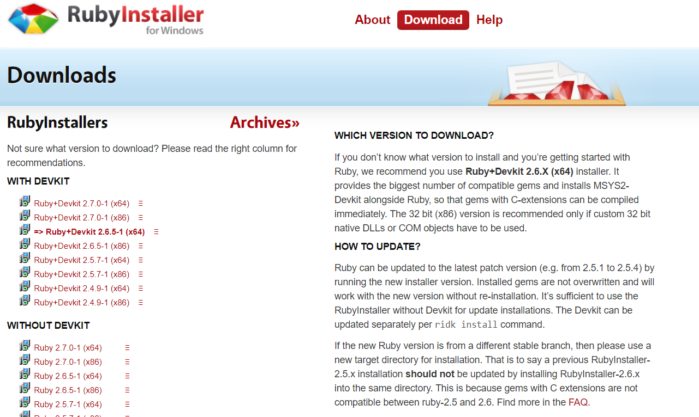
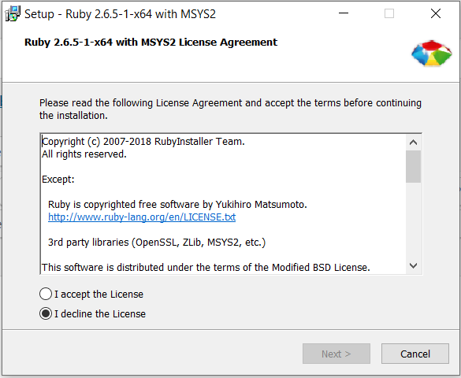
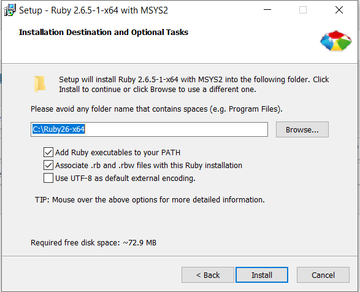
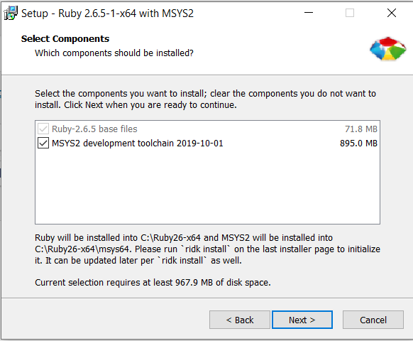
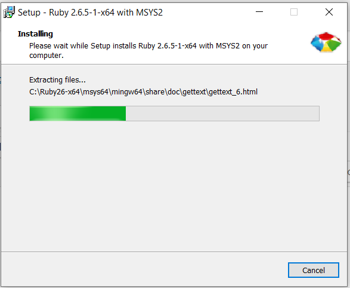
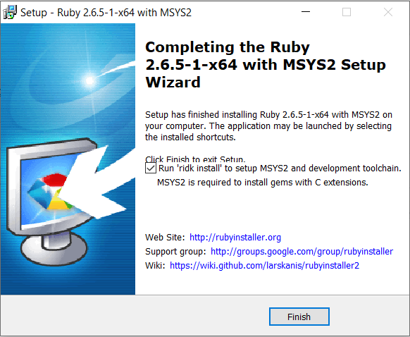
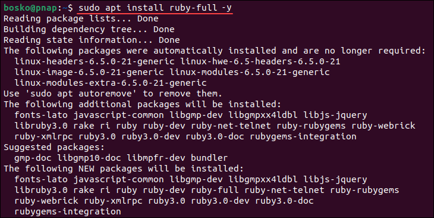

# Ruby Programming Language
# **RUBY**


## Table of Content:
1. Introduction
2. Audience
3. Getting Started with Ruby
   - Downloading and Installing Ruby on Windows 
   - Installing Ruby on Ubuntu
4. Basic Syntax
5. Data Types
6. Control Structures
7. Methods
8. Object-Oriented Programming
9. Modules and Mixins
10. Exception Handling
11. Conclusion
12. Reference links

## Introduction
Ruby is a scripting language designed by Yukihiro Matsumoto, also known as Matz. It runs on a variety of platforms, such as Windows, Mac OS, and the various versions of UNIX. This documentation gives you a complete understanding on Ruby.

## Audience
This documentation has been prepared for beginners to help them understand the basic to advanced concepts related to Ruby Scripting language.

## Downloading and Installing Ruby on Windows
All the versions of Ruby for Windows can be downloaded from rubyinstaller.org. Download the latest version and follow the further instructions for its Installation.


## Beginning with the installation:

- Getting Started with License Agreement:
  

- Selecting Installation Destination:
  
  
- Selecting components to be installed:
  

- Extracting Files and Installing:
  

- Finishing Installation:
  

## Installing Ruby on Ubuntu

- Update the system package repository information:
```bash
  $ sudo apt update
```
- Use the following command to install Ruby:
```bash
  $ sudo apt install ruby-full -y
``` 


- Once the installation completes, verify it by checking the current Ruby version:
```bash
  $ ruby --version
```

## Ruby Basic Syntax
### Print "Hello World"

### this line will print "Hello World!" as output.
```bash 
puts "Hello World!"; 
```

### Ruby BEGIN and END statement
BEGIN statement is used to declare a part of code which must be called before the program runs.

Syntax:
```bash
BEGIN
{
    # code written here
}
Similarly, END is used to declare a part of code which must be called at the end of program.
Syntax:

END
{
    # code written here
}
Example of BEGIN and END

### Ruby program of BEGIN and END 
puts "This is main body of program"
   
END 
{ 
   puts "END of the program"
} 
BEGIN 
{ 
   puts "BEGINNING of the Program"
} 
```

## Data Types
Data types in Ruby represents different types of data like text, string, numbers, etc. All data types are based on classes because it is a pure Object-Oriented language. There are different data types in Ruby as follows:

- Numbers:
 Ruby can handle both Integers and floating point numbers.
 ```bash
  #Ruby program to illustrate the Numbers Data Type and float type
    distance = 0.1

    #both integer and float type
    time = 9.87 / 3600
    speed = distance / time
    puts "The average speed of a sprinter is #{speed} km/h"
```

- Boolean:
 Boolean data type represents only one bit of information either true or false.
```bash
  #Ruby program to illustrate the Boolean Data Type
 
    if true
    puts "It is True!"
    else
    puts "It is False!"
    end
    
    if nil
    puts "nil is True!"
    else
    puts "nil is False!"
    end
    
    if 0
    puts "0 is True!"
    else
    puts "0 is False!"
    end
```

- Strings:
 A string is a group of letters that represent a sentence or a word. Strings are defined by enclosing a text within a single (”) or double (“”) quotes. You can use both double quotes and single quotes to create strings. Strings are objects of class String. Double-quoted strings allow substitution and backslash notation but single-quoted strings doesn’t allow substitution and allow backslash notation only for \\ and \’.
```bash
#Ruby program to illustrate the Strings Data Type:

    #!/usr/bin/ruby -w
    puts "String Data Type";
    puts 'escape using "\\"';
    puts 'That\'s right';
```

- Hashes:
 A hash assign its values to its key. Value to a key is assigned by => sign. A key pair is separated with a comma between them and all the pairs are enclosed within curly braces. A hash in Ruby is like an object literal in JavaScript or an associative array in PHP. They’re made similarly to arrays. A trailing comma is ignored.
```bash
#Ruby program to illustrate the Hashes Data Type
 
    #!/usr/bin/ruby
    hsh = colors = { "red" => 0xf00, "green" => 0x0f0, "blue" => 0x00f }
    hsh.each do |key, value|
    print key, " is ", value, "\n"
    end
```

- Arrays: 
An array stores data or list of data. It can contain all types of data. Data in an array are separated by comma in between them and are enclosed within square bracket.The position of elements in an array starts with 0. A trailing comma is ignored.
```bash
#Ruby program to illustrate the Arrays Data Type

    #!/usr/bin/ruby
    ary = [ "fred", 10, 3.14, "This is a string", "last element", ]
    ary.each do |i|
    puts i
    end
``` 
## Control Structures

### if-else statement
```bash
    # Ruby program to illustrate if - else statement

    a = 15

    # if condition to check whether age is enough for voting 
    if a >= 18
    puts "You are eligible to vote."
    else
    puts "You are not eligible to vote."
    end

```

### If – elsif – else ladder Statement
```bash
    # Ruby program to illustrate the if - else - if statement

    a = 78
    if a < 50
    puts "Student is failed"

    elsif a >= 50 && a <= 60
    puts "Student gets D grade"

    elsif a >= 70 && a <= 80
    puts "Student gets B grade"

    elsif a >= 80 && a <= 90
    puts "Student gets A grade"
        
    elsif a >= 90 && a <= 100
    puts "Student gets A+ grade"
    end
```

### Ternary Statement
```bash
    # Ruby program to illustrate the Ternary statement

    # variable
    var = 5;

    # ternary statement
    a = (var > 2) ? true : false ;
    puts a
```
### Loops

- While loop 
The while loop runs as long as the condition is true.
```bash
    i = 0

    while i < 5
    puts "i is #{i}"
    i += 1
    end
```
- For Loop
The for loop iterates over a range or collection.
```bash
    for i in 0..5
    puts "i is #{i}"
    end
```
- Each Loop
The each method is an iterator that runs a block of code for each element in a collection.
```bash
    [1, 2, 3, 4, 5].each do |number|
    puts "Number: #{number}"
    end
```

## Ruby | Methods
Method is a collection of statements that perform some specific task and return the result. Methods are time savers and help the user to reuse the code without retyping the code. Defining & Calling the method: In Ruby, the method defines with the help of def keyword followed by method_name and end with end keyword. A method must be defined before calling and the name of the method should be in lowercase. Methods are simply called by its name. You can simply write the name of method whenever you call a method. 

```bash
    # Ruby program to illustrate the defining and calling of method

    #!/usr/bin/ruby

    # Here my_method is the method name
    def my_method

    # statements to be displayed
    puts "Welcome to our documentation.."

    # keyword to end method
    end

    # calling of the method
    my_method
```
```bash
    # Ruby program to illustrate the parameter passing to methods

    #!/usr/bin/ruby

    # my_method is the method name
    # var1 and var2 are the parameters
    def my_method (var1 = "A", var2 = "B")

        # statements to be executed
        puts "First parameter is #{var1}"
        puts "First parameter is #{var2}"
    end

    # calling method with parameters
    my_method "Lavi", "Sharma"

    puts ""

    puts "Without Parameters"
    puts ""

    # calling method without passing parameters
    my_method
```

## Ruby | Object Oriented Programming

Ruby is a pure object-oriented language and everything appears to Ruby as an object. Every value in Ruby is an object, even the most primitive things: strings, numbers and even true and false. Even a class itself is an object that is an instance of the Class class. This chapter will take you through all the major functionalities related to Object Oriented Ruby.

We'll first introduce some terminology, then dive into examples.
- Encapsulation
Encapsulation is one of the fundamental concepts of object-oriented programming. At its core, encapsulation describes the idea of bundling or combining the data and the operations that work on that data into a single entity, e.g., an object.

- Polymorphism
Polymorphism is the ability for different types of data to respond to a common interface. For instance, if we have a method that invokes the move method on its argument, we can pass the method any type of argument as long as the argument has a compatible move method. 

- Inheritance
The concept of inheritance is used in Ruby where a class inherits -- that is, acquires -- the behaviors of another class, referred to as the superclass. This gives Ruby programmers the power to define basic classes with large reusability and smaller subclasses for more fine-grained, detailed behaviors.

### Ruby Class
When you define a class, you define a blueprint for a data type. This doesn't actually define any data, but it does define what the class name means, that is, what an object of the class will consist of and what operations can be performed on such an object.
Syntax:
```bash
    class classname
    end
```

### Classes Define Objects
Ruby defines the attributes and behaviors of its objects in classes. You can think of classes as basic outlines of what an object should be made of and what it should be able to do. To define a class, we use syntax similar to defining a method. We replace the **def** with **class** and use the CamelCase naming convention to create the name. We then use the reserved word end to finish the definition. Ruby file names should be in snake_case, and reflect the class name. 
```jsx
    class Good
    end
    # create the object of class 'Good' 
    goodOne = Good.new
```

```bash
    # Ruby program to understand the concept of class and objects..
    class Language 
    
        # Creating global variable 
        $reader = 'ABCD'
        def initialize(language_name, topic_name) 
            @language_name = language_name 
            @topic_name = topic_name 
        end
        
        # Defining Methods 
        def return_name 
            return @language_name
        end
        def return_topic 
            return @topic_name
        end
    end
    
    # Creating objects 
    object1 = Language.new('Ruby','method') 
    object2 = Language.new('Scala','string') 
    puts 'Language name for object1: ' + object1.return_name 
    puts 'Topic Name for object1: ' + object1.return_topic 
    
    puts 'Language name for object2: ' + object2.return_name 
    puts 'Topic Name for object2: ' + object2.return_topic 
    
    # Printing global variable 
    puts 'The reader is '+ $reader
```

## Ruby Modules and Mixins

Before studying about Ruby Mixins, we should have the knowledge about Object Oriented Concepts. If we don’t, go through One step above. When a class can inherit features from more than one parent class, the class is supposed to have multiple inheritance. But Ruby does not support multiple inheritance directly and instead uses a facility called **mixin**. Mixins in Ruby allows modules to access instance methods of another one using include method.
Mixins provides a controlled way of adding functionality to classes. The code in the mixin starts to interact with code in the class. In Ruby, a code wrapped up in a module is called mixins that a class can include or extend. A class consist many mixins.

Below is the example of Ruby Mixins.
Example:
```bash
    # Ruby program of mixins 
    
    # module consist 2 methods 
    module One
        def method1 
    end
    def method2
    end
    end
    
    # module consist 2 methods 
    module Two
    def method_1 
    end
    def method_2
    end
    end
    
    # Creating a class 
    class main_class 
    include One
    include Two
    def class_method 
    end
    end
    
    # Creating object 
    obj = main_class.new
    
    # Calling methods 
    obj.method1
    obj.method2
    obj.method_1
    obj.method_2
    obj.class_method
```

## Exception Handling
In Ruby, exception handling is a process which describes a way to handle the error raised in a program. Here, error means an unwanted or unexpected event, which occurs during the execution of a program, i.e. at run time, that disrupts the normal flow of the program’s instructions. So these types of errors were handled by the rescue block. Ruby also provides a separate class for an exception that is known as an Exception class which contains different types of methods.
The code in which an exception is raised, is enclosed between the begin/end block, so you can use a rescue clause to handle this type of exception.

Syntax:
```bash
begin
    raise
      # block where exception raise

    rescue
      # block where exception rescue
end
```

Example:
```bash
    # Ruby program to create the user defined exception and handling it 
    
    # defining a method 
    def raise_and_rescue      
    begin
            
        puts 'This is Before Exception Arise!'
            
        # using raise to create an exception   
        raise 'Exception Created!'
    
        puts 'After Exception' 
    
    # using Rescue method 
    rescue    
        puts 'Finally Saved!'    
        
    end    
    
    puts 'Outside from Begin Block!'    
    
    end    
    
    # calling method 
    raise_and_rescue 
``` 
## Conclusion:
Ruby is a dynamic, open-source programming language that emphasizes simplicity, productivity, and elegance. Created by Yukihiro "Matz" Matsumoto, Ruby has become a popular language for a wide range of applications, from web development to data processing.

### Key Strengths of Ruby
- **Readable and Expressive Syntax**: Ruby's syntax is designed to be intuitive and easy to read, making it an excellent choice for beginners and experienced developers alike.
- **Object-Oriented**: Everything in Ruby is an object, which allows for a consistent and flexible approach to programming.
- **Rich Standard Library**: Ruby comes with a comprehensive standard library that includes modules for handling tasks such as file manipulation, networking, and text processing.
- **Community and Ecosystem**: Ruby boasts a vibrant and active community. The ecosystem includes a plethora of libraries and frameworks, the most famous being Ruby on Rails, which significantly accelerates web application development.
- **Metaprogramming Capabilities**: Ruby's metaprogramming features enable developers to write highly flexible and reusable code.

### Applications of Ruby
Ruby is used in various domains, including but not limited to:
- **Web Development**: Ruby on Rails is a powerful framework for building web applications quickly and efficiently.
- **Automation and Scripting**: Ruby's simplicity makes it a great choice for writing scripts to automate tasks.
- **Data Processing**: Ruby's expressive syntax and rich libraries make it suitable for data manipulation and analysis.
- **Prototyping**: Ruby's rapid development capabilities make it ideal for prototyping and iterative development.


## Learning and Growing with Ruby
For those looking to deepen their understanding of Ruby, numerous resources are available:
- https://www.geeksforgeeks.org/ruby-programming-language/
- https://www.tutorialspoint.com/ruby/index.htm
- https://en.wikipedia.org/wiki/Ruby_(programming_language)
- https://www.youtube.com/watch?v=ml5sNqftiK4&list=PLS1QulWo1RIbNBXZAeVbkkHEj9zsEbXQK


